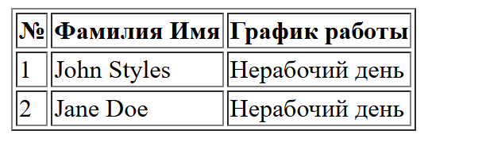
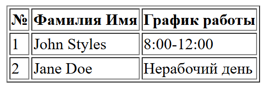
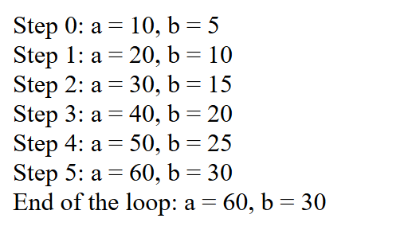

# Лабораторная работа №2. Управляющие конструкции

## Студент
**Gachayev Dmitrii I2302**  
**Выполнено 02.03.2025**  

## Цель работы
Освоить использование условных конструкций и циклов в PHP.
## Условные конструкции
### Задача
Необходимо использовать функцию `date()`, создать таблицу с расписанием на основе текущего дня недели. Реализовал следующим образом:

## Выполнение
`firstPart.php:`
```php
<?php
$dayOfWeek = date('N');

$schedule = [
    'John Styles' => [
        'work_days' => [1, 3, 5],
        'hours' => '8:00-12:00'
    ],
    'Jane Doe' => [
        'work_days' => [2, 4, 6],
        'hours' => '12:00-16:00'
    ]
];

echo "<table border='1'";
echo "<tr><th>№</th><th>Фамилия Имя</th><th>График работы</th></tr>";

$index = 1;
foreach ($schedule as $name => $data) {
    echo "<tr>";
    echo "<td>$index</td>";
    echo "<td>$name</td>";
    
    if (in_array($dayOfWeek, $data['work_days'])) {
        echo "<td>{$data['hours']}</td>";
    } else {
        echo "<td>Нерабочий день</td>";
    }
    
    echo "</tr>";
    $index++;
}

echo "</table>";
?>
```
Я определяю текущий день недели с помощью `$dayOfWeek = date('N');`, использую массив `$schedule` для хранения расписания сотрудников, проверяю, является ли день рабочим для сотрудника и заполняю созданную `HTML` таблицу.

Далее запускаю PHP Server и тестирую

case 1:

У обоих сотдруников нерабочий день




case 2:

У первого сотрудника рабочий день, у второго нерабочий день (включил в рабочие дни John Styles воскресенье)



Работает корректно.

## Циклы
### Задача
Необходимо переписать данный код, используя `while` и `do-while` циклы, сохранив функционал, а также добавить промежуточный вывод результатов в циклы.
### Выполнение

Изначально дан следующий `index.php`

```php
<?php

$a = 0;
$b = 0;

for ($i = 0; $i <= 5; $i++) {
   $a += 10;
   $b += 5;
}

echo "End of the loop: a = $a, b = $b";
```

Я изменяю его, добавляя вывод промежуточного результата:

`forLoop.php`

```php
<?php

$a = 0;
$b = 0;

for ($i = 0; $i <= 5; $i++) {
    $a += 10;
    $b += 5;
    echo "Step $i: a = $a, b = $b<br>";
}

echo "End of the loop: a = $a, b = $b\n";
?>
```
Затем переписываю код, меняя цикл сначала на `while`, затем на `do-while`:

`whileLoop.php`

```php
<?php

$a = 0;
$b = 0;
$i = 0;

while ($i <= 5) {
    $a += 10;
    $b += 5;
    echo "Step $i: a = $a, b = $b<br>";
    $i++;
}

echo "End of the loop: a = $a, b = $b\n";
?>
```

`doWhileLoop.php`

```php
<?php

$a = 0;
$b = 0;
$i = 0;

do {
    $a += 10;
    $b += 5;
    echo "Step $i: a = $a, b = $b<br>";
    $i++;
} while ($i <= 5);

echo "End of the loop: a = $a, b = $b\n";
?>
```
Все 3 программы выводят одинаковый результат:



## Контрольные вопросы
`В чем разница между циклами for, while и do-while? В каких случаях лучше использовать каждый из них?`

- `for` - Используется, когда известно точное количество итераций. Содержит инициализацию, условие и изменение счётчика в одном выражении.

- `while` - Используется, когда количество итераций неизвестно заранее, но условие должно быть проверено перед каждой итерацией.

- `do-while` - Выполняется как минимум один раз, так как проверка условия происходит после выполнения тела цикла. Используется когда код должен выполниться минимум один раз.

`Как работает тернарный оператор ? : в PHP?`

Тернарный оператор (условие ? выражение1 : выражение2) — это краткая запись if-else, возвращающая одно значение, если оно истинно и другое если оно ложно.

`Что произойдет, если в do-while поставить условие, которое изначально ложно?`

Цикл выполнится один раз, а затем завершится, так как условие проверяется после выполнения тела цикла.

## Вывод
В данной лабораторной работе я изучил условные конструкции в PHP, а также узнал о разнице циклов `for`, `while` и `do-while` в PHP.

## Библиография
1. Веб-ресурс w3schools [www.w3schools.com](https://www.w3schools.com/)
2. Курс Advanced Web Programming [https://moodle.usm.md/course/view.php?id=7161](https://moodle.usm.md/course/view.php?id=7161)
3. Условие лабораторной работы на GitHub [https://github.com/MSU-Courses/advanced-web-programming/tree/main/Lab/02_Control_Flow](https://github.com/MSU-Courses/advanced-web-programming/tree/main/Lab/02_Control_Flow)